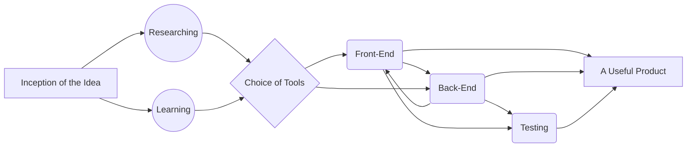

#  Healio  	: `One Stop Solution to Healthcare Needs`
Thought of as a **Website** while having room for always **Growth**.
## Features

> Under-Active Development:

A Medicine Timer and Tracker
###
A Diet Suggester and Tracker
###
## Proposed UI / UX

> Under Active Development.  
> Maybe Subjected to Change.

Inspired by **Material Design**. And *Minimalistic* Visuals that are easy to understand look **modern**.
###
Home-Page Proposed UI/UX

###
###
Another Page from Proposed UI/UX

## About Us
Project is a learning experience from the Very Basic of Web-D for us.
###
Our Path:

